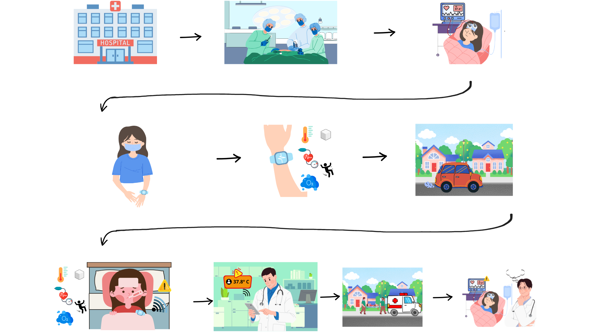
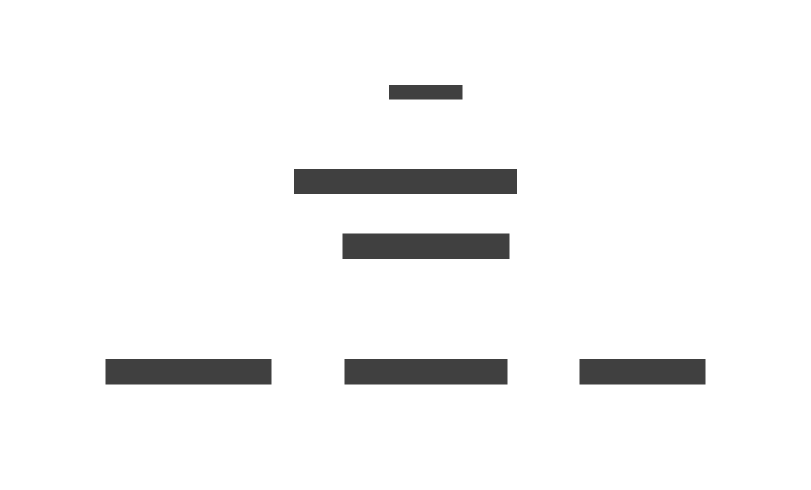
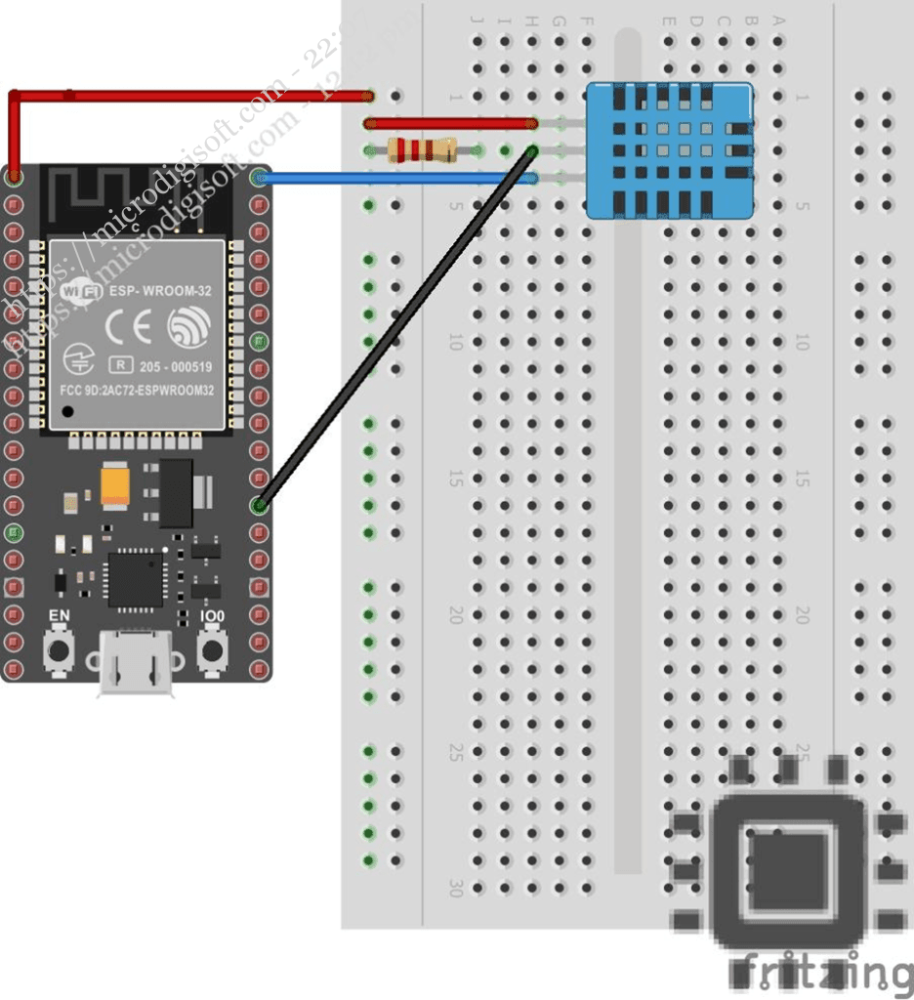
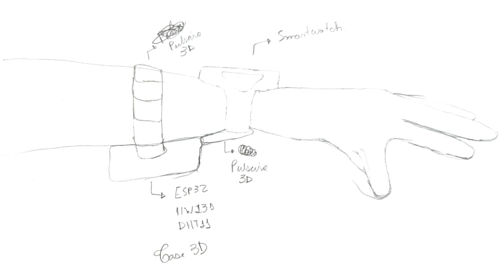
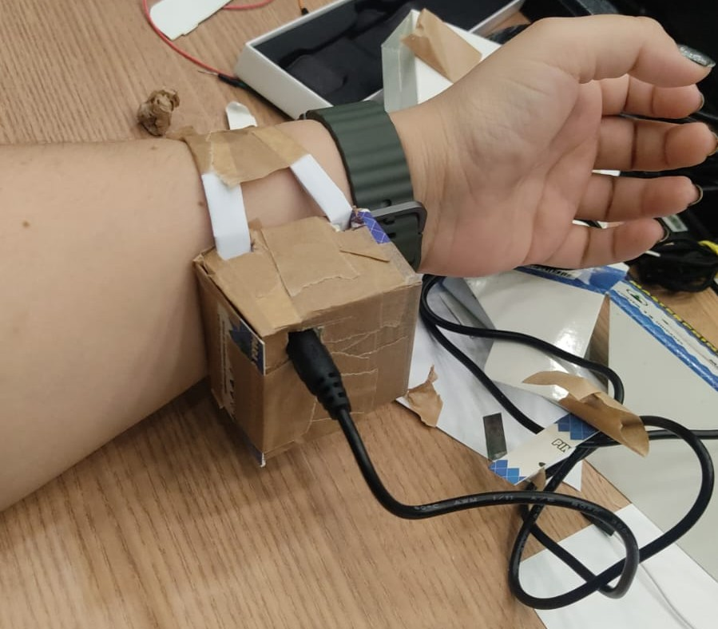

# Maloca das iCoisas - Hands On Avançado

[Link](https://github.com/gabiel98/gabiel98-maloca-das-icoisas-avancado)

Projeto realizado no curso [Maloca das iCoisas](https://github.com/Maloca-iCoisas) durante o módulo avançado. Somos o grupo 4 - Os Suricatos Cibernéticos, e nosso projeto é a continuação daquele que demos início no módulo intermediário. Ele consiste em um dispositivo de monitoramento de pacientes pós-cirúrgicos.

Alguns dos diferenciais deles são:

- Disponibilização de API disponível publicamente para cadastro de pacientes e sincronização de dados com Health Connect;
- Disponibilização de dashboard, acoplado com modelos de IA para detecção de anomalias, para uso de médicos, enfermeiros e profissionais de saúde autônomos;
- Alertas para que as respostas a emergências sejam mais rápidas e assertivas.

> [!NOTE]
> Destacamos os créditos ao [Shuchir Jain](https://shuchir.dev/), criador do [HCGateway](https://github.com/ShuchirJ/HCGateway). Sem o trabalho dele, não teria sido possível desenvolver a API em tempo hábil para finalizar o projeto.

## Big Picture

### Storytelling

- [Pitch Video do Produto](https://www.youtube.com/watch?v=69h1PzXl2rQ).
- Big Picture 

### Situação Hipotética
1. **Paciente faz cirurgia**: O paciente é cadastrado no sistema via Dashboard PSM 2.0, Dispositivos (Galaxy Watch 7 e sensor DHT11) são vinculados ao paciente, Os sensores são configurados para iniciar o monitoramento imediatamente após a cirurgia.  
2. **Paciente é monitorado no hospital**: Sensores coletam dados em tempo real: temperatura, pressão arterial, batimentos cardíacos, movimento, oxigênio e glicose, Dados são transmitidos via Samsung Health SDK para o backend Flask, Gráficos em tempo real são exibidos no Dashboard para a equipe médica.  
3. **Monitoramento contínuo no hospital**: Limiares de alerta são configurados (ex.: temperatura > 37.8°C, batimentos > 130 BPM), Se um parâmetro ultrapassar o limite, o sistema publica um alerta no tópico MQTT, Médicos recebem notificações em seus dispositivos m[oveis(Smartphone e Tablet) e Computador.  
4. **Paciente recebe alta e vai para casa**: O paciente recebe um dispositivo portátil (Galaxy Watch 7 + sensor DHT11) configurado para modo remoto, Os dados continuam sendo transmitidos via Wi-Fi/Bluetooth para o backend, O Dashboard atualiza o status do paciente para "Monitoramento Remoto".  
5. **Paciente passa mal em casa**: O sensor detecta febre alta (39°C) e pressão arterial crítica (80/50 mmHg), O Flask gera um alerta imediato (ALERT:Febre detectada,Pressão arterial baixa) e publica no MQTT, Latência do alerta: < 10 segundos.
6. **Médico recebe notificação e toma providências**: O médico recebe uma notificação em seu Dispositivo com detalhes do alerta, Confirma o alerta , registrando a ação no histórico, Acessa o Dashboard para analisar os dados em tempo real do paciente.  
7. **Ambulância resgata o paciente**: O médico aciona a ambulância, compartilhando automaticamente os dados críticos (endpoint /emergencia), A ambulância recebe informações como localização, últimos sinais vitais e histórico médico.
8. **Paciente retorna ao hospital**: O status do paciente é atualizado para "Readmitido" no sistema, Novos dados de avaliação são registrados no Firestore.  
9. **Acompanhamento do histórico do paciente**: O médico filtra dados por período (ex.: últimas 24 horas) e métricas, Gera um relatório em CSV com tendências de temperatura e batimentos, Dados históricos são usados para ajustar o tratamento (ex.: antibioticoterapia para febre persistente).

 
## Equipe 

- **Product Owner**: Thaís Oliveira Almeida
- **Scrum Master**: Eduardo Henrique Freire Machado

### Equipe de Desenvolvimento 

- Eduardo Henrique Freire Machado;
- Gabriel Peixoto Menezes da Costa;
- Natália Ribeiro de Almada;

## Esquema de Conexão

### Dispositivo do Paciente
 

### Requisitos

#### Hardware

- 1 ESP32;
- 1 Sensor DHT11;
- 2 Galaxy Watch 7;

#### Software

- Flask;
- Docker;
- MongoDB;
- Coolify;
- Streamlit;
- [HCGateway](https://github.com/ShuchirJ/HCGateway);
- Arduino IDE com as bibliotecas DHT e WiFi;
- Integração com Samsung Health SDK;

## Recursos

### Feitos 
- [Big Picture](https://www.canva.com/design/DAGX9015E_Y/igNJWoiv6dB_DmXLwmla8g/edit?utm_content=DAGX9015E_Y&utm_campaign=designshare&utm_medium=link2&utm_source=sharebutton)
- [Kanban](https://trello.com/invite/b/67f9814a70391e1f77704678/ATTI7b5a3cc73e9dc276db2bb33731acf766C5B92480/hands-on-maloca-avancado)
- [Documento de Requisitos Funcionais](https://docs.google.com/document/d/139STMAsBITp9Wc13MITmVtwTrKqo48Z1CFOeEzPEa9E/edit?usp=sharing)
- [Documento de Progresso](https://docs.google.com/document/d/1bgMEeEQhJlnWOdWcRUyse7d14oNcHCMup1lYqwKh_Mo/edit?usp=sharing)
- [Draft do Dashboard](https://docs.google.com/document/d/1C2ehc7o-pFcvJAB2sn8F75oxu_O5OohuYzn4Uq6_mu0/edit?usp=sharing)
- [Pitch](https://www.canva.com/design/DAGlHtj_Dbw/z7gQhzEXTac-saG-JPqG7Q/edit?utm_content=DAGlHtj_Dbw&utm_campaign=designshare&utm_medium=link2&utm_source=sharebutton)
- [Impressão 3D da manopla](https://www.tinkercad.com/things/jRywDCm9EJq-copy-of-manopla-pos-cirurgica-suricates-?sharecode=0sUWq_mmopyBLxGs9N16jS2lAAK12oiFNIAJIxsAgPY)

#### Rascunho do protótipo

#### Protótipo Físico

